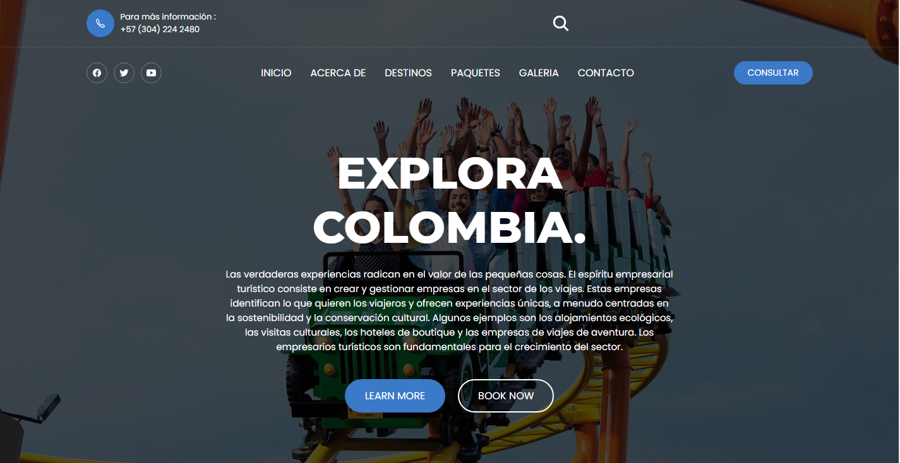

<div align="center"> 
  
  
  
  

  <br />
  <br />
  
  

  <h2 align="center">Turismo Camball</h2>

  Turismo Camball es un sitio web completamente responsivo enfocado en el turismo en Colombia, diseñado para adaptarse a todos los dispositivos. Desarrollado utilizando HTML, CSS, JavaScript y Flask.

  <a href="https://andres1996u.github.io/TurismoCamball/"><strong>➥ Live Demo</strong></a>

</div>

<br />

---

### Capturas del Proyecto



---

### Requisitos Previos

Antes de comenzar, asegúrate de tener los siguientes requisitos:

* [Git](https://git-scm.com/downloads "Descargar Git") debe estar instalado en tu sistema operativo.
* Un entorno de desarrollo como [VSCode](https://code.visualstudio.com/) o similar.

---

### Ejecutar Localmente

Para ejecutar **Turismo Camball** localmente, ejecuta este comando en tu terminal:

#### Linux y macOS:

```bash
sudo git clone https://github.com/andres1996u/TurismoCamball.git
